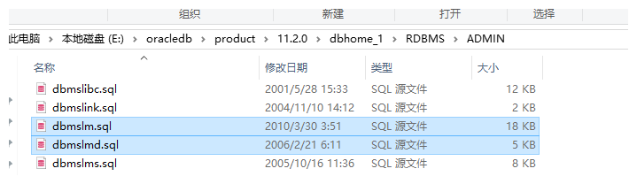
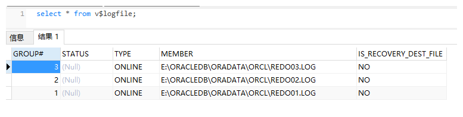
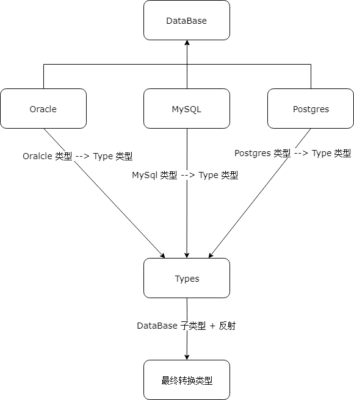

## **前言**

### 技术背景

监控Oracle 中的数据库表的 DDL 情况，然后根据相关的 DDL 操作，修改目标数据库（MySQL、Postgres）中的表映射关系和表结构。

## 准备阶段(安装LogMiner)

### 简介

- 介绍
  - Oracle LogMiner 是Oracle公司从产品8i以后提供的一个实际非常有用的分析工具
- 作用
  - 跟踪数据库的变化：可以离线的跟踪数据库的变化，而不会影响在线系统的性能。
  - 回退数据库的变化：回退特定的变化数据，减少point-in-time recovery的执行。
  - 优化和扩容计划：可通过分析日志文件中的数据以分析数据增长模式

### 安装

以 DBA 用户身份运行下列 2 个脚本：

```
$ORACLE_HOME/rdbms/admin/dbmslm.sql
```

```
$ORACLE_HOME/rdbms/admin/dbmslmd.sq
```

   

### 使用

#### 创建数据字典文件

1. 以 DBA 账号登录

```
sqlplus user/passwd as sysdba
```

2. 查看数据字典文件目录

```
show parameter utl_file_dir
```

3. 设置 数据字典文件目录

```
alter system set utl_file_dir='E:\oracledb\dic' scope=spfile;
```

4. 关闭、重启数据库：

```
shutdown immediate
startup
```

5. 查看数据字典文件目录

```
show parameter utl_file_dir
```

6. 在数据字典目录下创建数据字典文件

```
exec dbms_logmnr_d.build( 'dictionary.ora', 'E:\oracledb\dic')
```

#### 添加待分析的日志文件

1. 查看日志文件

   

2. 添加待分析的日志文件

```
exec dbms_logmnr.add_logfile('E:\ORACLEDB\ORADATA\ORCL\REDO01.LOG', dbms_logmnr.new);
```

```
exec dbms_logmnr.add_logfile('E:\ORACLEDB\ORADATA\ORCL\REDO02.LOG', dbms_logmnr.addfile);
```

```
exec dbms_logmnr.add_logfile('E:\ORACLEDB\ORADATA\ORCL\REDO03.LOG', dbms_logmnr.addfile);
```

#### 使用 LogMiner 进行日志分析

1. 筛选 scn > 56270853 的日志

```
dbms_logmnr.start_logmnr(
	startScn=>56270853,
	dictfilename=>'E:\oracledb\dic\dictionary.ora'
);
```

1. 查询 pccgz 用户的相关的操作信息

```
SELECT scn,operation,timestamp,status,sql_redo
FROM v$logmnr_contents
WHERE seg_owner in （‘pccgz’）
AND seg_type_name='TABLE' AND operation !='SELECT_FOR_UPDATE'
```

## Java 处理 Oracle 日志信息

### LogMiner 和 Java 集成

实现方式：采用 JDBC 自带的 CallableStatement 完成上述的操作

>   [链接地址](https://github.com/RainPoetry/core/blob/master/oracle-log/src/main/java/com/cc/oracle/monitor/logminer/LogMiner.java) 

### 提取 LogMiner 中的关键数据

主要思想：采用正则表达式，匹配出所需要的信息

- 提取目标表名称和操作类型

  ```java
  String CORE_REGEX = "ALTER TABLE \"\\w+\"\\.\"([^\"]+)\"\\s+(\\w+).+";
  ```

- 提取 ADD、Modify 操作的信息

  ```java
  String ADD_MODIFY_REGEX = "(?<=\\s)((ADD|MODIFY)\\s)\\(([^\\)]+)\\)";
  ```

- 提取 DROP 操作的信息

  ```java
  String DROP_REGEX = "(?<=[\\(,])\\s*([^\\),]+)";
  ```

- 提取 Rename操作的信息

  ```java
  String RENAME_REGEX = "(?<=RENAME COLUMN)\\s+\"(\\w+)\"\\s+TO\\s+\"(\\w+)\"";
  ```

  [链接地址](https://github.com/RainPoetry/core/tree/master/oracle-log/src/main/java/com/cc/oracle/monitor/modifyGroup/ddl) 

### 优雅的实现各种数据库间的类型转换

如下图，Types 是一个枚举类型，持有所有的是数据库类型，Oracle、MySQL、Postgres 等所包含的数据类型都能与 Types 的某个类型达成映射关系。

  

实现效果：

- Oracle 的 VARCHAR2  --->  MySQL 对应的 VARCHAR

  ```java
  String type = Oracle.of("VARCHAR2").to(MySql.class);
  // 更通用的方式
  String type2 = DataBase.from(Oracle.class,"VARCHAR2").to(MySql.class);
  ```

- MySQL 中的 BIGINT --->  Posgres 中的 INT8

  ```java
  String type = MySql.of("BIGINT").to(Postgres.class);
  // 更通用的方式
  String type2 = DataBase.from(MySql.class,"BIGINT").to(Postgres.class);
  ```
    [链接地址](https://github.com/RainPoetry/core/blob/master/guava-cc/src/main/java/com/rainpoetry/common/db/relation)
